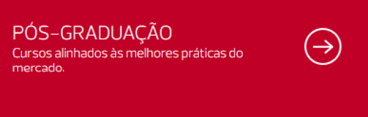
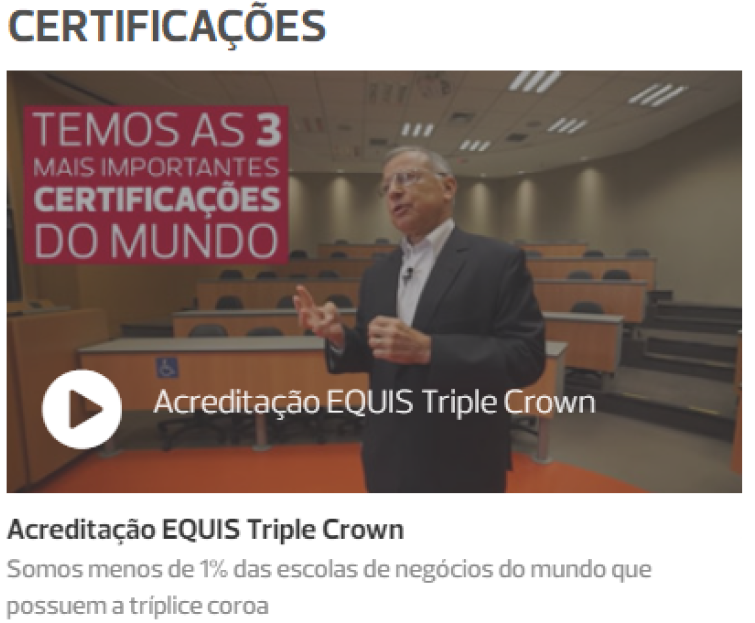
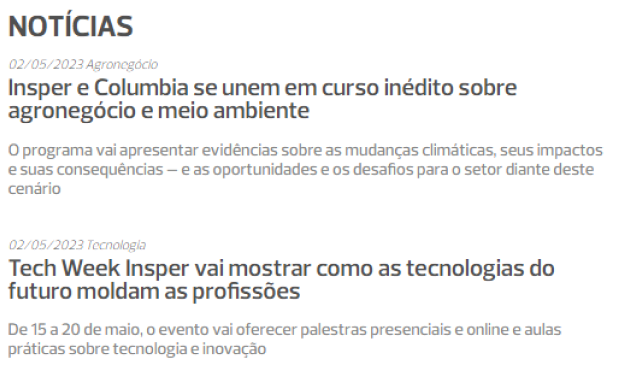
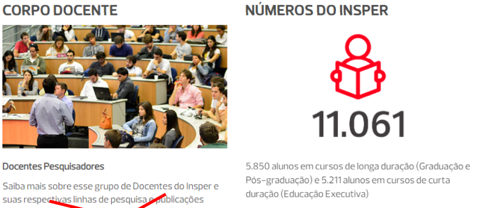
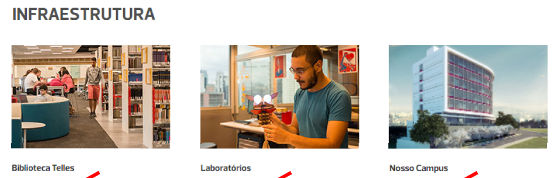
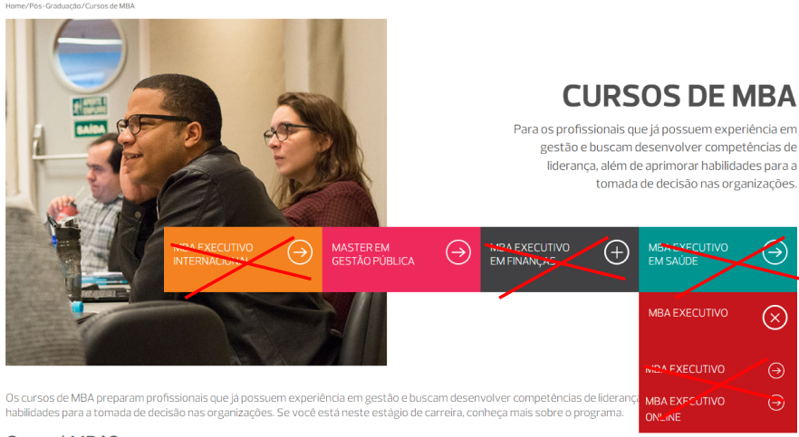
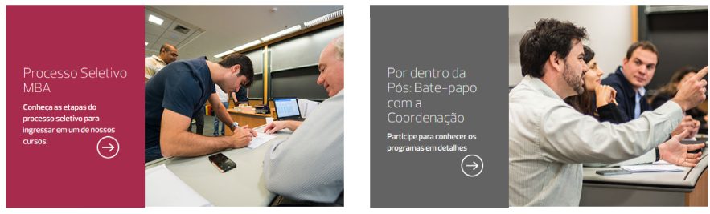
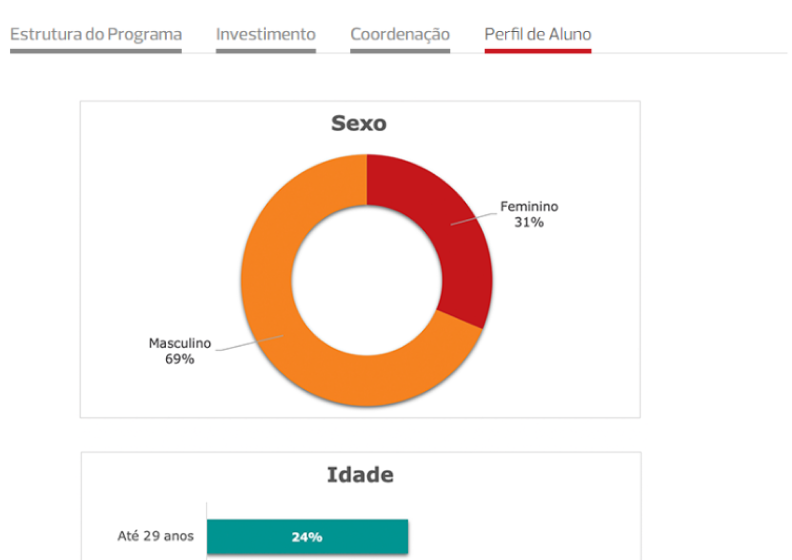

# POC - **Insper**

## Participantes
- [@José Anderson](https://github.com/jose-andersonjr)
- [@Kaique Lopes](https://github.com/kaiquelopess)
- [@Pedro Queiroz](https://github.com/Shinji-Q)
- [@Thiago Calado](https://github.com/uzumis)

## TODOs

- [x] Criar Archetype
- [ ] Criação do Template Padrão
- [x] Mapear os Componentes para o AEM, apenas os Autoraveis, alguns serão estáticos e mockados
- [ ] Mapear as libs(css, js) corretas necessaria para a POC
- [ ] Criação das Páginas
- [ ] Validação da Navegação e Autoração dos Componentes

## LISTAGEM DE COMPONENTES - INSPER

### PÁGINA 1

#### COMPONENTE 1 - BANNER/CAROUSEL - [@Thiago Calado](https://github.com/uzumis)

#### COMPONENTE 2 - BOTÃO

#### COMPONENTE 3 - LISTA DE NOTÍCIA (TRENDITEMS) - [@José Anderson](https://github.com/jose-andersonjr)

#### COMPONENTE 4 - COMPONENTE DE NOTÍCIA COM EMBED

#### COMPONENTE 5 - NOTÍCIAS EM TEXTO (BYLINE)

#### COMPONENTE 6 - SESSÃO DE NOTÍCIAS (TRENDITEMS) - [@José Anderson](https://github.com/jose-andersonjr)

#### COMPONENTE 7 - COMPONENTE DE NOTÍCIA SEM A DESCRIÇÃO (TRENDITEMS) - [@José Anderson](https://github.com/jose-andersonjr)

### PÁGINA 2

#### COMPONENTE 1 - TEXTO + IMAGE + BOTÃO NO TOPO

#### COMPONENTE 2 - TEXTO + IMAGEM COM OPÇÃO DE COR NO FUNDO DO TEXTO - [@José Anderson](https://github.com/jose-andersonjr)

### PÁGINA 3 

#### COMPONENTE 3 - COMPONENTE DE ABAS ESTATÍSTICAS - [@Thiago Calado](https://github.com/uzumis)

### PÁGINA 4

#### COMPONENTE 4 - CAROUSEL DE AUTORES

#### Componente proximas turmas - Thiago

### Templates
- [ ] PRIMEIRO TEMPLATE PARA PÁGINA 1 E 2
- [ ] SEGUNDO TEMPLATE PARA PÁGINA 3 E 4

